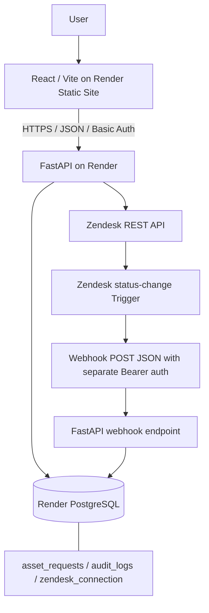
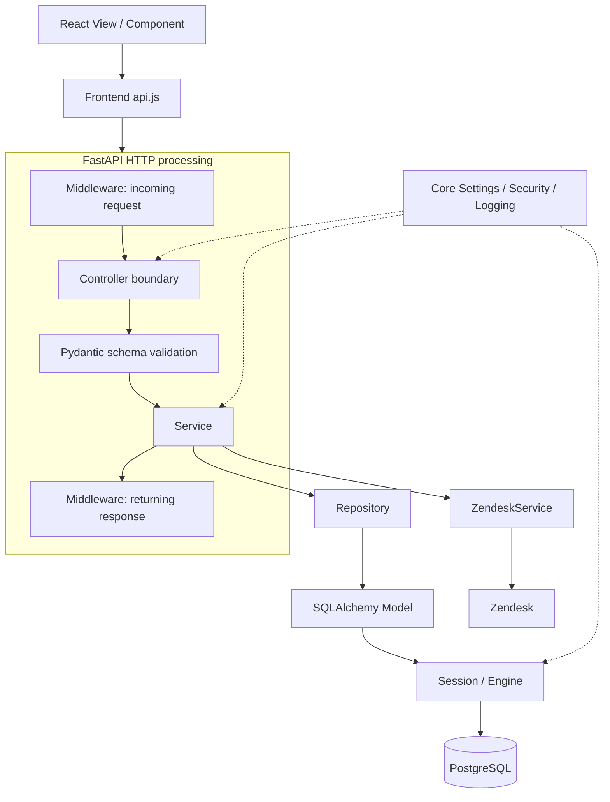
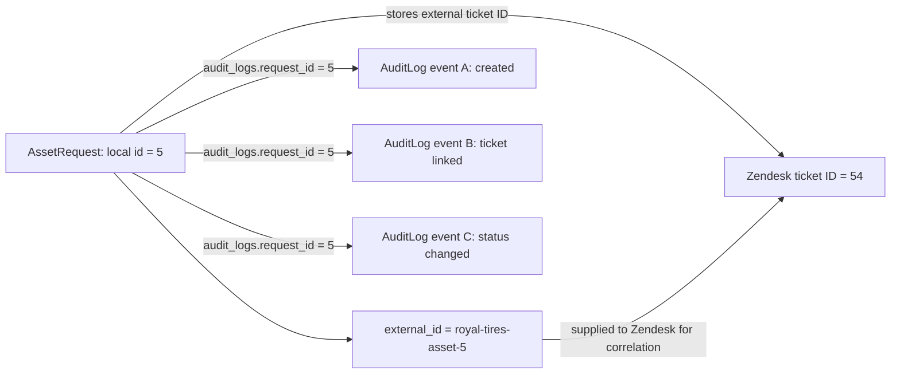
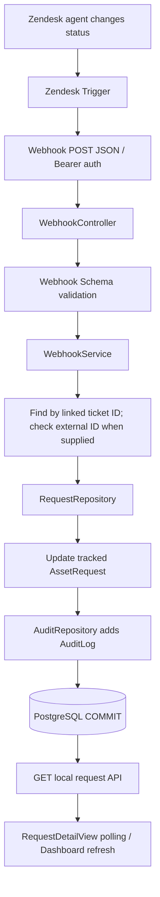
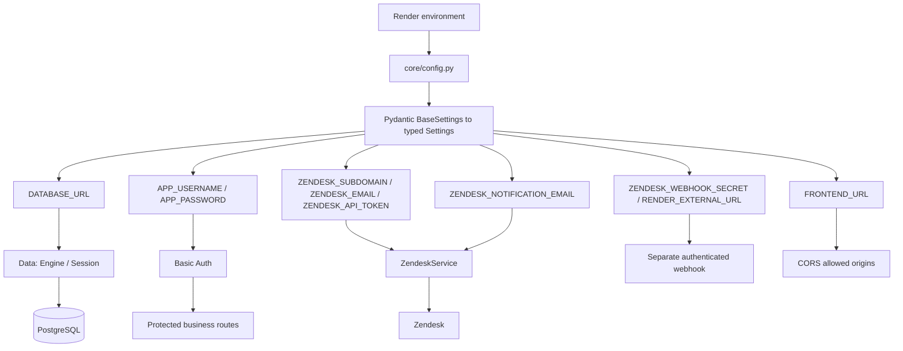
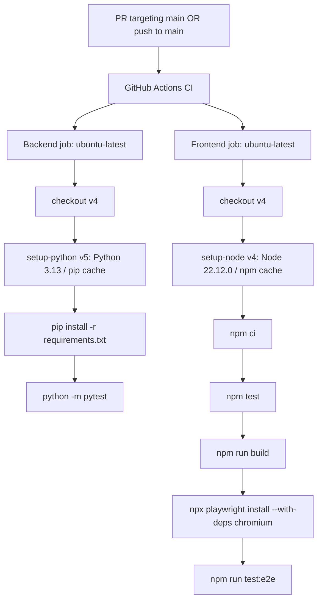

# Royal Tyres IT Asset Request Tool

An internal IT asset request portal for Mohammed Farhaan Buckas's Royal Tyres technical interview. The authoritative architecture and implementation notes are in [PROJECT_SPEC.md](PROJECT_SPEC.md).

React/Vite views call thin FastAPI controllers, which delegate to services, repositories and SQLAlchemy models. Local development uses SQLite. The hosted interview application uses Render Static Sites for the frontend, Render for FastAPI, Render PostgreSQL for persistence, and a Zendesk sandbox as the helpdesk integration.

The local SQL request is committed before any Zendesk call. A Zendesk outage therefore cannot discard an employee request.

## Physical MVC structure

The repository now physically mirrors the MVC mental model documented in `PROJECT_SPEC.md` instead of keeping several unrelated responsibilities in root modules.

```text
frontend/src/
├── views/                 # page-level Views
│   ├── RequestView.jsx
│   ├── DashboardView.jsx
│   ├── RequestDetailView.jsx
│   ├── SettingsView.jsx
│   └── ZendeskSetupView.jsx
├── layouts/               # shared page shells
│   ├── AppLayout.jsx
│   └── AuthLayout.jsx
├── components/            # Partial / reusable Views
│   ├── shared/
│   │   ├── Brand.jsx
│   │   ├── Sidebar.jsx
│   │   ├── Topbar.jsx
│   │   └── Footer.jsx
│   ├── AssetRequestForm.jsx
│   ├── StatusBadge.jsx
│   └── SyncStatePanel.jsx
├── services/
│   └── api.js             # browser HTTP service
├── helpers/
│   ├── formatting.js
│   └── validation.js
├── App.jsx                # client routing + composition
└── main.jsx               # React entry point

backend/app/
├── controllers/           # FastAPI HTTP endpoints
│   ├── request_controller.py
│   ├── zendesk_controller.py
│   └── webhook_controller.py
├── services/              # business/use-case orchestration
│   ├── request_service.py
│   ├── zendesk_service.py
│   ├── webhook_service.py
│   └── legacy_trigger_guard.py
├── repositories/          # persistence access only
│   ├── request_repository.py
│   ├── audit_repository.py
│   └── zendesk_repository.py
├── models/                # SQLAlchemy entities
│   ├── asset_request.py
│   ├── audit_log.py
│   └── zendesk_connection.py
├── schemas/               # Pydantic DTOs / ViewModels
│   ├── request_schema.py
│   ├── zendesk_schema.py
│   └── webhook_schema.py
├── data/                  # DbContext-equivalent infrastructure
│   ├── base.py
│   ├── db_context.py
│   └── session.py
├── middleware/
│   ├── request_logging.py
│   └── security_headers.py
├── helpers/
│   └── request_identity.py
├── core/                  # config, auth, logging policy
└── main.py                # application composition root
```

SQLAlchemy infrastructure lives exclusively in `backend/app/data/`. Controllers and services import the data/session modules directly; there is no root database compatibility facade.

The interview explanation is therefore direct:

```text
USER
  ↓
VIEW / PARTIAL VIEW
  ↓
CONTROLLER
  ↓
SERVICE
  ↓
REPOSITORY
  ↓
MODEL
  ↓
DB CONTEXT / SESSION
  ↓
POSTGRESQL
```

Zendesk branches from the Service layer as an external integration, while middleware wraps the HTTP pipeline and schemas validate API boundaries.

## User-facing structure

The portal is organized around three primary application surfaces plus FastAPI's generated API documentation:

- **New request** (`/request`): submit an IT asset request.
- **Dashboard** (`/dashboard`): monitor requests, search by request ID/requester/email/asset/Zendesk ticket, filter active/solved/sync-error records, and open any request for detailed tracking.
- **Settings** (`/settings`): account/session information, developer diagnostics and the governed Zendesk configuration workflow.
- **Swagger API docs** (`/docs` on the Render backend): generated by FastAPI and opened from the portal as an external developer surface rather than duplicated inside React.

A request detail route (`/requests/{id}`) is reached from the Dashboard table and shows the Portal → Zendesk → authenticated webhook synchronization path. The old `/requests` queue route remains a dashboard alias and `/zendesk-setup` remains a settings alias so older demo links do not break.

## Local setup

Prerequisites: Python 3.13 and Node.js 22.12+.

Backend, from `backend`:

```powershell
python -m venv .venv
.venv\Scripts\python -m pip install -r requirements.txt
Copy-Item .env.example .env
.venv\Scripts\python -m uvicorn app.main:app --reload
```

Frontend, from `frontend`:

```sh
npm ci
# Copy .env.example to .env and configure VITE_API_URL.
npm run dev
```

Local API: `http://localhost:8000/health`  
Swagger: `http://localhost:8000/docs`  
Frontend: `http://localhost:5173`

## Validation

Backend:

```text
python -m pytest
```

Frontend:

```text
npm test
npm run build
npm run test:e2e
```

GitHub Actions runs the backend suite, frontend unit tests, Vite production build and Playwright Chromium tests on pull requests and `main`.

Business Reason validation is enforced independently on the frontend and backend. Whitespace, tabs and newline characters do not count toward the minimum 10 meaningful characters.

## Environment

| Variable | Purpose |
| --- | --- |
| `APP_USERNAME`, `APP_PASSWORD` | Backend-only demo Basic Auth credentials |
| `DATABASE_URL` | SQLite locally or Render PostgreSQL hosted |
| `FRONTEND_URL` | Explicit allowed frontend origin(s) |
| `ZENDESK_SUBDOMAIN` | Backend-only Zendesk sandbox subdomain |
| `ZENDESK_EMAIL`, `ZENDESK_API_TOKEN` | Backend-only Zendesk API authentication |
| `ZENDESK_WEBHOOK_SECRET` | Separate bearer secret for Zendesk → FastAPI status callbacks |
| `ZENDESK_NOTIFICATION_EMAIL` | Demo email receiver; defaults to `farhaanhotd1@gmail.com` |
| `ZENDESK_LEGACY_TRIGGER_GUARD_ENABLED` | Opt-in guard for the confirmed pre-existing sandbox triggers that must ignore Royal Tyres |
| `RENDER_EXTERNAL_URL` | Render-provided public backend origin used for the webhook callback |
| `VITE_API_URL` | Public API origin; frontend environment value |

Zendesk credentials and webhook secrets never enter the React application.

## Governed Zendesk setup

Zendesk configuration lives under **Settings**. Its flow is:

```text
Test backend ENV credentials
→ discover current Zendesk state
→ show CREATE / REUSE / UPDATE / SKIP plan
→ fingerprint the exact plan
→ explicit human approval
→ re-read and reject drift
→ apply approved changes only
→ read everything back
→ verify PASS / FAIL
```

The project-owned plan covers the Royal Tyres Brand, IT Service Desk Group, ticket fields, IT Asset Request Form, request View, demo email Target, status Webhook and project Triggers. Existing sandbox safeguards are shown separately and can only receive the explicitly approved Royal Tyres brand exclusion.

## Live workflow

```text
Employee submits request
→ PostgreSQL commit
→ Zendesk ticket created
→ demo notification email
→ request appears in Dashboard
→ agent changes Zendesk status
→ Zendesk trigger calls authenticated FastAPI webhook
→ PostgreSQL status updated
→ Dashboard / request detail show the new status
```

The request detail page refreshes its local API data every 10 seconds while open and provides a manual **Refresh status** button. The browser never calls Zendesk directly.

## Interview architecture

Use the [file-by-file interview guide](docs/INTERVIEW_GUIDE.md) to follow imports and responsibilities. The diagrams describe an **MVC-style layered mental model**, not traditional server-rendered ASP.NET MVC. FastAPI validates schema input before invoking a route function; the schema box denotes that boundary, not a second HTTP request.

### 1. System architecture



### 2. MVC-style code flow



Service chooses **why and when** an operation happens. Repository expresses **how** ORM persistence happens using the supplied Session. A Model describes a SQL entity; a Schema describes validated input/output. Layouts are reusable page shells, components are smaller UI pieces, and helpers contain small reusable logic.

### 3. Create request sequence

```mermaid
sequenceDiagram
    actor Employee
    participant Form as AssetRequestForm / RequestView
    participant API as frontend api.js
    participant C as RequestController / AssetRequestCreate
    participant S as RequestService
    participant R as RequestRepository / AssetRequest Model
    participant DB as PostgreSQL via Session
    participant ZS as ZendeskService
    participant Z as Zendesk Tickets API
    Employee->>Form: Enter asset request
    Form->>API: Validated form values
    API->>C: POST /api/requests + Basic Auth
    C->>C: FastAPI validates AssetRequestCreate
    C->>S: Typed request and scoped Session
    S->>R: Add AssetRequest
    R->>DB: Stage insert; flush obtains local ID
    S->>DB: Stage REQUEST_CREATED via AuditRepository
    S->>DB: COMMIT primary request and audit
    Note over S,Z: POSTGRESQL COMMIT OCCURS BEFORE ZENDESK CALL
    S->>ZS: Create ticket for committed request
    ZS->>Z: POST ticket with correlation ID
    alt Zendesk succeeds
        Z-->>ZS: Zendesk ticket ID and status
        ZS-->>S: Ticket result
        S->>DB: Store ticket ID, synced state and audit; COMMIT
    else Expected Zendesk failure
        ZS-->>S: Safe ZendeskError
        S->>DB: KEEP request; mark sync_failed; audit failure; COMMIT
    end
    S-->>C: Persisted request
    C-->>API: HTTP 201 response DTO
    API-->>Form: Show local ID and integration state
```

If Zendesk is not configured, the request stays saved with `sync_pending`. A database flush obtains an ID but is not a commit. Integration failure handling does not implement automatic retries or manual reconciliation.

### 4. Identifiers and audit relationship

**These IDs are examples, not live test evidence.**



The local database generates `AssetRequest.id`; Zendesk generates `zendesk_ticket_id`, which is stored locally in a nullable unique column. The deterministic external ID correlates systems: it is neither encryption nor hashing nor the database primary key. `audit_logs.request_id` is a foreign key to `asset_requests.id`, giving one request many chronological audit events. AuditLog is persisted PostgreSQL history, **not authentication/session state**. ZendeskConnection holds safe singleton metadata and external resource IDs; those external IDs are not local foreign keys.

### 5. Zendesk status callback



In an ordinary outbound API call, this application initiates the request. A webhook reverses that direction: Zendesk initiates an HTTP request after an event. Both use HTTP APIs. The callback uses a separate bearer secret; portal Basic Auth is not accepted as webhook authentication.

RequestDetailView polls every 10 seconds and offers a local-data refresh. Dashboard loads on entry/manual refresh and searches the latest 100 loaded records. Neither browser View calls Zendesk. The service writes `ZENDESK_STATUS_CHANGED` to the audit table for changed status, or `ZENDESK_WEBHOOK_RECEIVED` for duplicate status; its application log line is `zendesk_status_sync`. Duplicate callbacks update the sync timestamp and add receipt history; event ordering is not implemented.

### 6. Environment and security



Runtime injection means the hosting environment supplies values when the backend starts, rather than embedding them in GitHub. Pydantic Settings converts those values to typed configuration; `.env` supports local development. Frontend public configuration is compiled into the Vite build and must contain no secrets.

- **Basic Auth:** required by this assignment; sent on protected requests over HTTPS. Base64 is encoding, not encryption. Browser credentials remain in memory; there is no server login session table.
- **CORS:** explicit browser-origin policy, not authentication. Non-browser clients still need Basic Auth.
- **Pydantic:** validates types, allowed values and lengths; Business Reason needs ten non-whitespace characters. Schemas are contracts, not SQL tables.
- **SQLAlchemy:** ORM statements bind input as data rather than concatenate executable SQL. SQL injection means user input becomes SQL syntax.
- **React/XSS:** user-controlled values render as normal text; no `dangerouslySetInnerHTML`. XSS would occur if malicious text became executable HTML/JavaScript.
- **Response headers:** `X-Content-Type-Options: nosniff` limits MIME guessing; API `Cache-Control: no-store` discourages caching sensitive responses. These do not protect cookies or make REST stateless.
- **Logging:** request middleware passes the request to the controller and logs method, matched route and response status on return. It does not currently measure duration. It omits headers/bodies/query strings; Zendesk error extraction separately redacts known secrets.
- **Data lifecycle:** Base registers Models; Engine owns driver/pool configuration; session factory creates a request-scoped Session through `get_db`. Repositories receive that Session. Services commit transactions; request cleanup closes the Session. This package is an ApplicationDbContext mental bridge, not an Entity Framework class.

### 7. CI pipeline



The jobs run independently in their backend/frontend directories. Workflow/ref concurrency cancels superseded runs. Backend tests use temporary SQLite and mock Zendesk; Playwright uses desktop/mobile Chromium with intercepted API responses. These are automated verification, not proof of live delivery or hosted PostgreSQL behavior.

CI does not inherently deploy. Required branch-protection checks can make it a merge gate, but branch protection has not been asserted here. Render auto-deployment on main changes is separate; no redundant manual deployment is needed. Live evidence and any manual checks are recorded in [the verification report](docs/LIVE_VERIFICATION.md).

## Pull request progression

PR1–PR4 cover scaffold, core API, security and request UI. PR5 added governed Zendesk setup and ticket creation. PR6 corrected live Zendesk API field/view values. PR7 added email notifications, webhook status callbacks and tracking-page synchronization. PR8 expanded the MVC architecture map. PR9 improved safe Zendesk validation diagnostics. PR10 fixed cross-field Zendesk option-tag collisions. PR11 added opt-in isolation for confirmed legacy sandbox triggers. PR12 fixed meaningful Business Reason validation. PR13 added the request queue and sync explanation. PR14 promoted the queue into the searchable Dashboard and moved Zendesk setup under Settings. PR15 added restrained GSAP motion and an automotive visual layer. PR16 aligned the palette with Royal Tyres red/charcoal branding. PR17 physically aligns the codebase with the documented MVC folder targets while preserving behavior.
