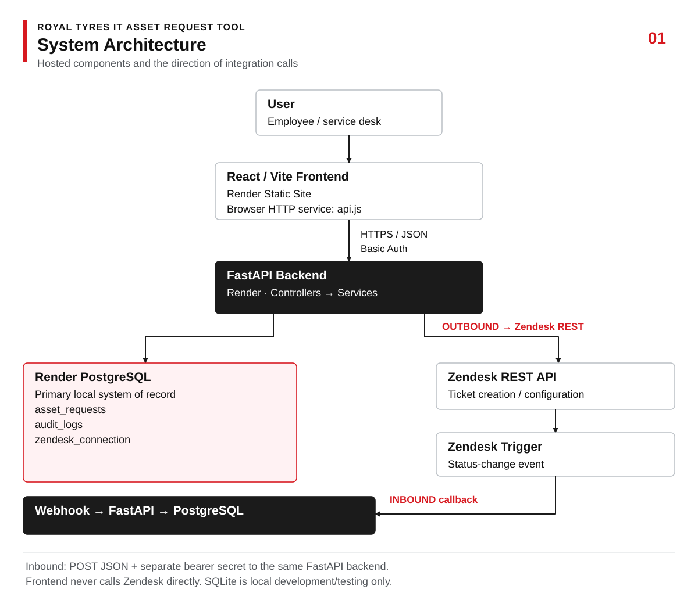
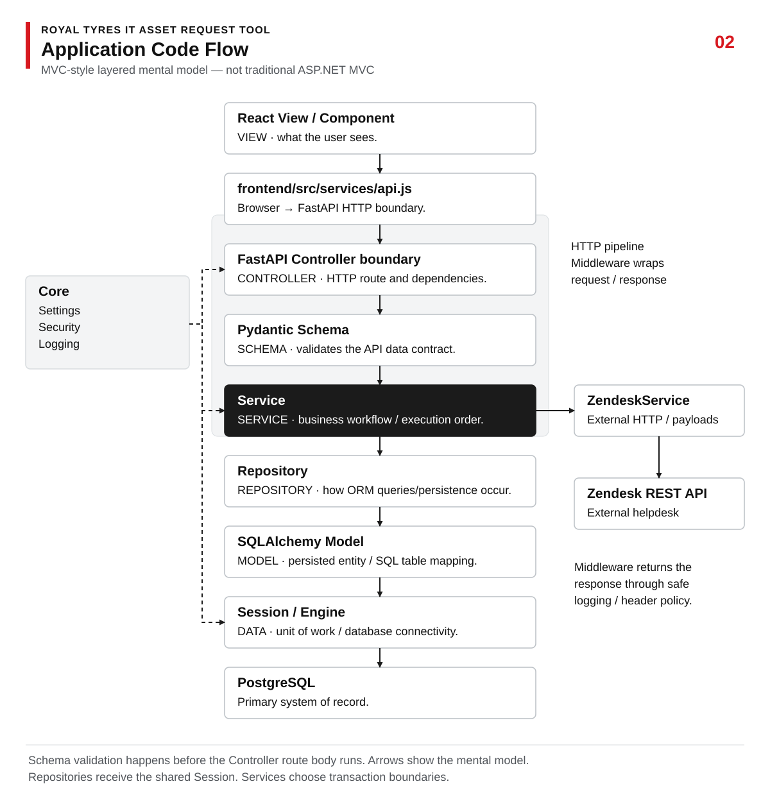
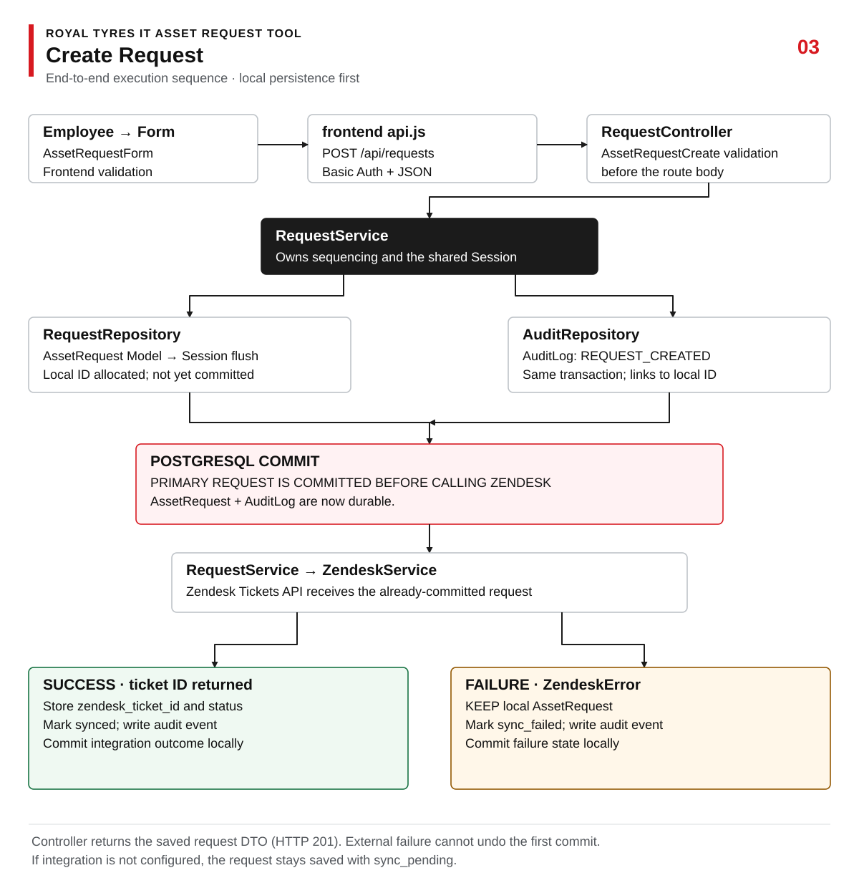
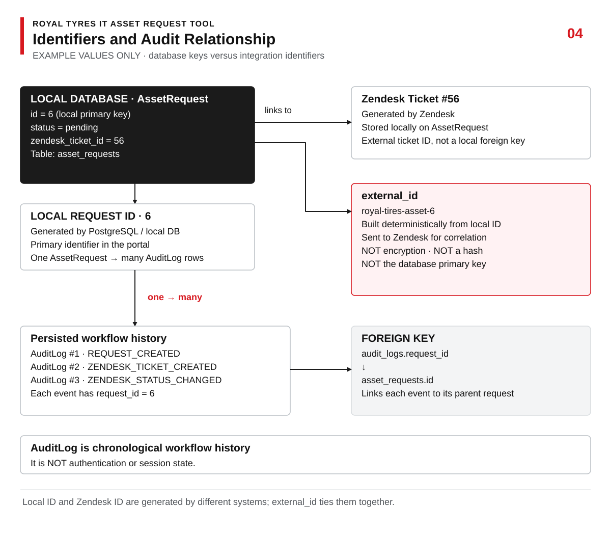
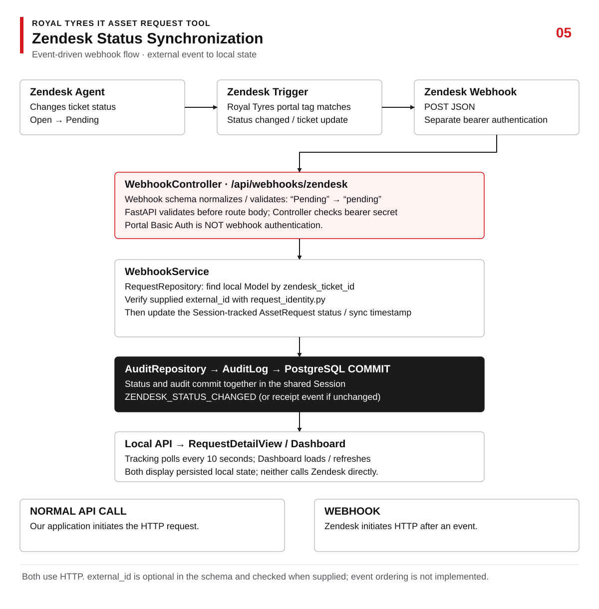
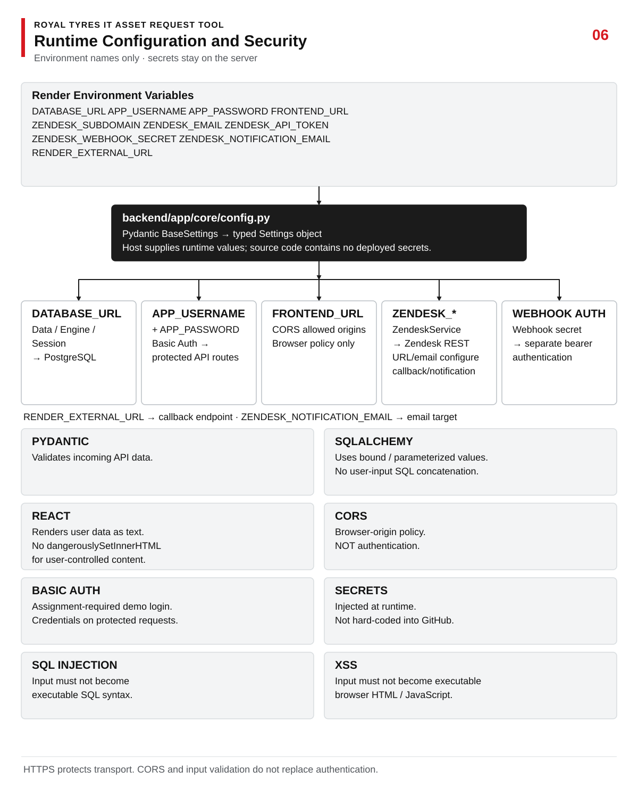
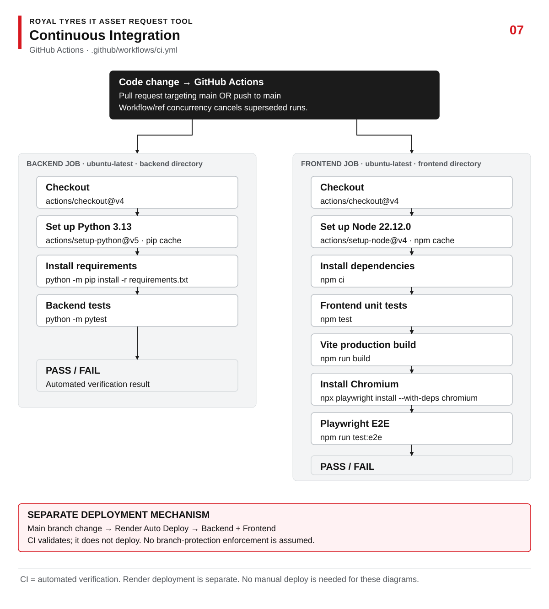
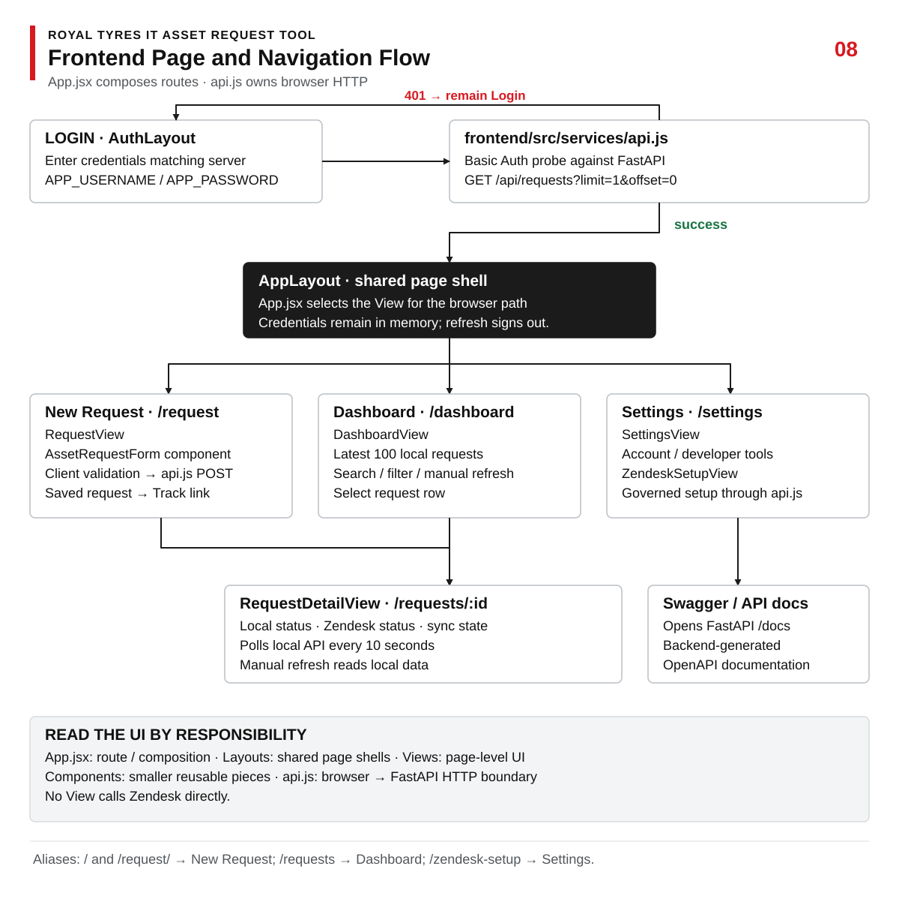

# Royal Tyres IT Asset Request Tool

A React + FastAPI IT Asset Request Tool built for the Royal Tyres **IT Developer Automation Engineer** technical review.

The application deliberately implements the requested vertical slice first, then demonstrates additional engineering practices around integration, testing, auditability, configuration and deployment. The authoritative implementation notes are in [PROJECT_SPEC.md](PROJECT_SPEC.md).

## Live demo

- **Frontend:** https://royal-tires-frontend.onrender.com
- **Backend health:** https://royal-tires-api.onrender.com/health
- **Swagger / OpenAPI:** https://royal-tires-api.onrender.com/docs
- **Demo access:** credentials supplied separately during the interview.

## Interview requirements and current implementation

| Requirement | Current implementation |
| --- | --- |
| Frontend asset-request form with validation | React/Vite request form with client-side validation and independent backend Pydantic validation. |
| Backend API endpoint | FastAPI REST endpoints for creating, listing and retrieving asset requests, with generated Swagger/OpenAPI documentation. |
| Store request in SQL or JSON | SQLAlchemy persistence with hosted Render PostgreSQL; SQLite is supported for local development and tests. |
| Input validation / SQL Injection / XSS protection | Pydantic validates API boundaries, SQLAlchemy uses bound values instead of interpolated SQL, and React renders user-controlled values as escaped text. |
| Basic Auth | Environment-configured HTTP Basic authentication protects the business API routes and simulates the logged-in user required by the brief. |
| Logging or helpdesk ticket simulation | Application request logging, persisted PostgreSQL `AuditLog` history, and real Zendesk ticket creation provide both auditability and helpdesk simulation. |
| Code hosted on GitHub | Public GitHub repository with pull-request history, automated CI, architecture diagrams and interview-oriented documentation. |

**Presentation format from the brief:** 0–15 minutes presentation/demo, followed by 16–30 minutes technical Q&A.

## Additional engineering demonstrated

- Zendesk REST API ticket integration.
- Zendesk → FastAPI authenticated webhook status synchronization.
- Audit history and cross-system ID correlation.
- Runtime configuration and secret injection through environment variables.
- PostgreSQL as the primary local system of record, committed before external Zendesk calls.
- Failure isolation when Zendesk is unavailable.
- GitHub Actions continuous integration.
- pytest backend tests, frontend unit tests, Vite production build and Playwright E2E tests.
- Render frontend/backend/PostgreSQL hosting.
- Governed Zendesk configuration with dry-run planning, fingerprinted approval, drift detection and read-back verification.

[**Detailed file-by-file interview walkthrough**](docs/INTERVIEW_GUIDE.md) · [**Recorded live verification evidence**](docs/LIVE_VERIFICATION.md) · [**Authoritative project specification**](PROJECT_SPEC.md)

## Architecture diagrams

All images are repository-owned SVGs. Open an image to zoom; [editable generator and Mermaid references](docs/diagrams/source/README.md) remain available.

### System architecture



PostgreSQL is the primary local system of record. Outbound Zendesk calls and inbound authenticated callbacks go through FastAPI; the browser never calls Zendesk directly.

### MVC-style layer flow



This is an MVC-style mental model, not traditional server-rendered ASP.NET MVC. Schema validation precedes the route body; Services own sequencing and Repositories use the injected SQLAlchemy Session.

### Create request sequence



The primary request and creation audit commit before Zendesk is called. A Zendesk failure therefore leaves the local request safely persisted and records the integration failure separately.

### Identifiers and audit



The example values illustrate the distinction between the local database ID, Zendesk ticket ID and deterministic external correlation ID. `AuditLog` records form persisted workflow history linked back to the request.

### Zendesk webhook flow



Zendesk status changes are posted back to FastAPI through a separately authenticated webhook. The callback validates and normalizes the event, verifies correlation and updates local state plus audit history.

### Environment and security



Runtime settings feed database connectivity, Basic Auth, CORS and Zendesk integration components. Environment values are supplied by the host rather than hard-coded into source control.

### CI pipeline



GitHub Actions validates backend tests, frontend unit tests, the Vite production build and Playwright browser tests. CI validation is separate from Render deployment.

### Frontend page flow



`App.jsx` composes shared layouts and page Views. `api.js` centralizes browser-to-FastAPI HTTP communication, while Settings exposes governed Zendesk setup and developer links.

## Physical repository structure

The repository physically mirrors the MVC-style layered mental model used throughout the documentation.

```text
frontend/src/
├── views/                 # page-level Views
│   ├── RequestView.jsx
│   ├── DashboardView.jsx
│   ├── RequestDetailView.jsx
│   ├── SettingsView.jsx
│   └── ZendeskSetupView.jsx
├── layouts/               # shared page shells
│   ├── AppLayout.jsx
│   └── AuthLayout.jsx
├── components/            # Partial / reusable Views
│   ├── shared/
│   │   ├── Brand.jsx
│   │   ├── Sidebar.jsx
│   │   ├── Topbar.jsx
│   │   └── Footer.jsx
│   ├── AssetRequestForm.jsx
│   ├── StatusBadge.jsx
│   └── SyncStatePanel.jsx
├── services/
│   └── api.js             # browser HTTP service
├── helpers/
│   ├── formatting.js
│   └── validation.js
├── App.jsx                # client routing + composition
└── main.jsx               # React entry point

backend/app/
├── controllers/           # FastAPI HTTP endpoints
│   ├── request_controller.py
│   ├── zendesk_controller.py
│   └── webhook_controller.py
├── services/              # business/use-case orchestration
│   ├── request_service.py
│   ├── zendesk_service.py
│   ├── webhook_service.py
│   └── legacy_trigger_guard.py
├── repositories/          # persistence access only
│   ├── request_repository.py
│   ├── audit_repository.py
│   └── zendesk_repository.py
├── models/                # SQLAlchemy entities
│   ├── asset_request.py
│   ├── audit_log.py
│   └── zendesk_connection.py
├── schemas/               # Pydantic DTOs / ViewModels
│   ├── request_schema.py
│   ├── zendesk_schema.py
│   └── webhook_schema.py
├── data/                  # DbContext-equivalent infrastructure
│   ├── base.py
│   ├── db_context.py
│   └── session.py
├── middleware/
│   ├── request_logging.py
│   └── security_headers.py
├── helpers/
│   └── request_identity.py
├── core/                  # config, auth, logging policy
└── main.py                # application composition root
```

SQLAlchemy infrastructure lives in `backend/app/data/`. Controllers and services use the physical data/session modules directly; there is no root database compatibility facade.

The interview mental model is:

```text
USER
  ↓
VIEW / PARTIAL VIEW
  ↓
CONTROLLER
  ↓
SCHEMA VALIDATION
  ↓
SERVICE
  ↓
REPOSITORY
  ↓
MODEL
  ↓
DB CONTEXT / SESSION / ENGINE
  ↓
POSTGRESQL
```

Zendesk branches from the Service layer as an external integration, while middleware wraps the HTTP pipeline and schemas validate API boundaries.

## Running locally

Prerequisites: Python 3.13 and Node.js 22.12+.

Backend, from `backend`:

```powershell
python -m venv .venv
.venv\Scripts\python -m pip install -r requirements.txt
Copy-Item .env.example .env
.venv\Scripts\python -m uvicorn app.main:app --reload
```

Frontend, from `frontend`:

```sh
npm ci
# Copy .env.example to .env and configure VITE_API_URL.
npm run dev
```

Local API: `http://localhost:8000/health`  
Swagger: `http://localhost:8000/docs`  
Frontend: `http://localhost:5173`

## Testing

Backend:

```text
python -m pytest
```

Frontend:

```text
npm test
npm run build
npm run test:e2e
```

GitHub Actions runs the backend suite, frontend unit tests, Vite production build and Playwright Chromium tests on pull requests and `main`.

Business Reason validation is enforced independently on the frontend and backend. Whitespace, tabs and newline characters do not count toward the minimum 10 meaningful characters.

## Environment

| Variable | Purpose |
| --- | --- |
| `APP_USERNAME`, `APP_PASSWORD` | Backend-only demo Basic Auth credentials |
| `DATABASE_URL` | SQLite locally or Render PostgreSQL hosted |
| `FRONTEND_URL` | Explicit allowed frontend origin(s) |
| `ZENDESK_SUBDOMAIN` | Backend-only Zendesk sandbox subdomain |
| `ZENDESK_EMAIL`, `ZENDESK_API_TOKEN` | Backend-only Zendesk API authentication |
| `ZENDESK_WEBHOOK_SECRET` | Separate bearer secret for Zendesk → FastAPI status callbacks |
| `ZENDESK_NOTIFICATION_EMAIL` | Demo email receiver |
| `ZENDESK_LEGACY_TRIGGER_GUARD_ENABLED` | Opt-in guard for approved pre-existing sandbox triggers that must ignore Royal Tyres |
| `RENDER_EXTERNAL_URL` | Render-provided public backend origin used for the webhook callback |
| `VITE_API_URL` | Public API origin used by the frontend |

Zendesk credentials and webhook secrets never enter the React application.

## Security notes

Basic Auth protects business routes over hosted HTTPS; the Zendesk webhook uses a separate bearer secret. Pydantic validates API input, SQLAlchemy binds values as data rather than interpolating them into raw SQL, and React renders user-controlled values as text. CORS accepts explicit browser origins and is not used as authentication.

Credentials remain server-side except the assignment-required portal credentials held in browser memory for Basic Auth. Secrets are not stored in Vite configuration, documentation or logs. PostgreSQL is primary; SQLite is only for local development/tests.

## Interview walkthrough

[**Detailed file-by-file interview walkthrough**](docs/INTERVIEW_GUIDE.md) includes module responsibilities, a glossary and a method for tracing unknown code. [Editable diagram sources](docs/diagrams/source/README.md) provide the visual reference; [PROJECT_SPEC.md](PROJECT_SPEC.md) remains authoritative.

<details>
<summary>Additional workflow and project history reference</summary>

### User-facing structure

The portal is organized around three primary application surfaces plus FastAPI's generated API documentation:

- **New request** (`/request`): submit an IT asset request.
- **Dashboard** (`/dashboard`): monitor requests, search by request ID/requester/email/asset/Zendesk ticket, filter active/solved/sync-error records, and open any request for detailed tracking.
- **Settings** (`/settings`): account/session information, developer diagnostics and the governed Zendesk configuration workflow.
- **Swagger API docs** (`/docs` on the Render backend): generated by FastAPI and opened from the portal as an external developer surface rather than duplicated inside React.

A request detail route (`/requests/{id}`) is reached from the Dashboard table and shows the Portal → Zendesk → authenticated webhook synchronization path. The old `/requests` queue route remains a dashboard alias and `/zendesk-setup` remains a settings alias so older demo links do not break.

### Governed Zendesk setup

Zendesk configuration lives under **Settings**. Its flow is:

```text
Test backend ENV credentials
→ discover current Zendesk state
→ show CREATE / REUSE / UPDATE / SKIP plan
→ fingerprint the exact plan
→ explicit human approval
→ re-read and reject drift
→ apply approved changes only
→ read everything back
→ verify PASS / FAIL
```

The project-owned plan covers the Royal Tyres Brand, IT Service Desk Group, ticket fields, IT Asset Request Form, request View, demo email Target, status Webhook and project Triggers. Existing sandbox safeguards are shown separately and can only receive the explicitly approved Royal Tyres brand exclusion.

### Live workflow

```text
Employee submits request
→ PostgreSQL commit
→ Zendesk ticket created
→ demo notification workflow
→ request appears in Dashboard
→ agent changes Zendesk status
→ Zendesk trigger calls authenticated FastAPI webhook
→ PostgreSQL status updated
→ Dashboard / request detail show the new status
```

The request detail page refreshes its local API data every 10 seconds while open and provides a manual **Refresh status** button. The browser never calls Zendesk directly.

### Pull request progression

PR1–PR4 cover scaffold, core API, security and request UI. PR5 added governed Zendesk setup and ticket creation. PR6 corrected live Zendesk API field/view values. PR7 added email notifications, webhook status callbacks and tracking-page synchronization. PR8 expanded the MVC architecture map. PR9 improved safe Zendesk validation diagnostics. PR10 fixed cross-field Zendesk option-tag collisions. PR11 added opt-in isolation for confirmed legacy sandbox triggers. PR12 fixed meaningful Business Reason validation. PR13 added the request queue and sync explanation. PR14 promoted the queue into the searchable Dashboard and moved Zendesk setup under Settings. PR15 added restrained GSAP motion and an automotive visual layer. PR16 aligned the palette with Royal Tyres red/charcoal branding. PR17 physically aligned the codebase with the documented MVC folder targets. PR19 added final live integration evidence and interview documentation. PR20 added inline architectural handoff comments. PR21 added the rendered architecture diagrams.

</details>
