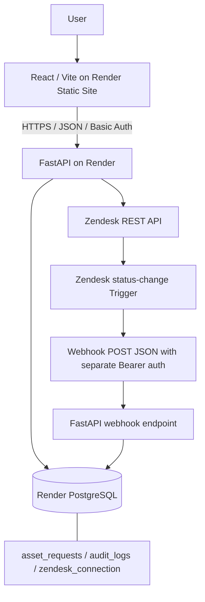
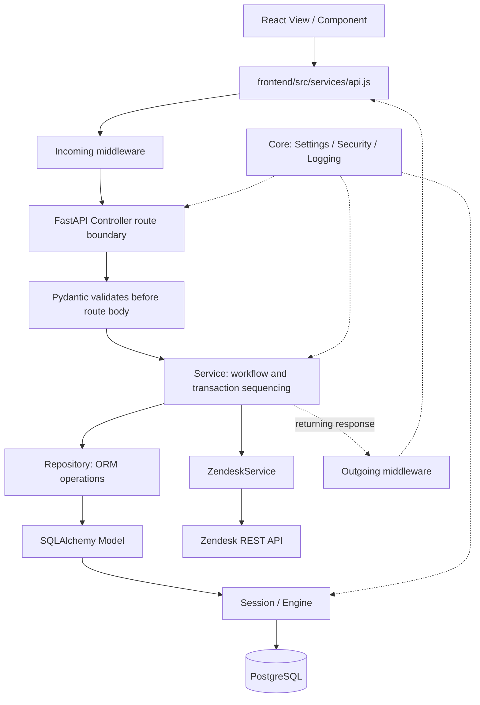
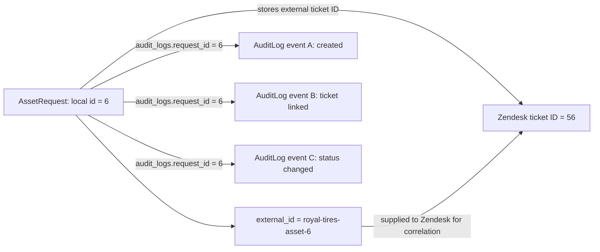
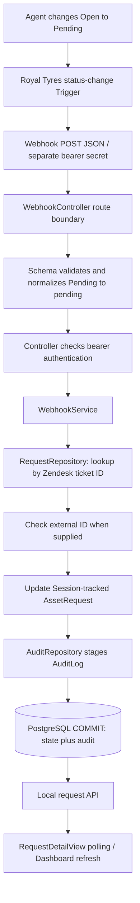
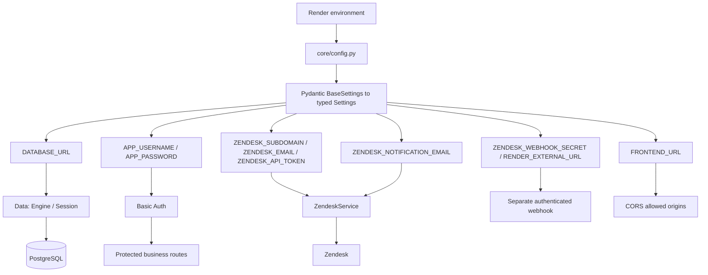
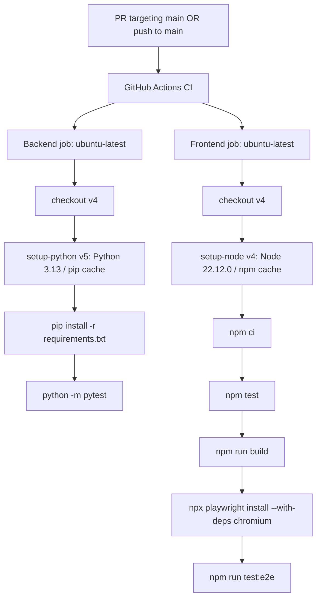
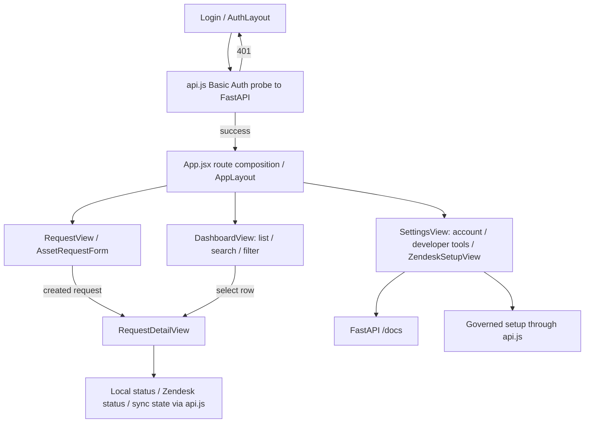

# Editable diagram sources

The SVG images are generated by [generate.py](generate.py), using Python standard-library string/XML output. It contains the editable labels, coordinates and palette; no external fonts, images, scripts, application imports or runtime credentials are used.

```sh
python docs/diagrams/source/generate.py
```

Run from the repository root (the script also resolves output correctly from another directory). Output is deterministic. Review the SVGs after changing labels or geometry.

The `.mmd` files preserve the seven earlier README Mermaid diagrams as conceptual references, with current-code corrections to schema ordering, optional webhook correlation and example IDs. Diagram 08 adds a navigation reference. These are not the SVG layout generator: update both representations when architecture changes.

Verified against main commit `e959419`: Controllers/schemas, request and webhook Services, repositories/Models, Data Session/Engine, Core authentication/configuration, frontend api.js/routes, and the actual CI workflow. No branch-protection enforcement, retry queue, migration system, or direct browser-to-Zendesk link is implied.

Important distinctions: FastAPI validates before the route body; webhook bearer authentication is in that body. RequestService constructs AssetRequest, repositories stage/query it, and Service-owned Session commits persist it. WebhookService queries via RequestRepository before checking a supplied external ID. RequestDetailView polls local state; Dashboard refreshes on load/manual action. These are architecture illustrations, not proof of a new live test.

## 01 — system architecture



## 02 — code layer flow



## 03 — create request sequence

```mermaid
sequenceDiagram
    actor Employee
    participant Form as AssetRequestForm / RequestView
    participant API as frontend api.js
    participant C as RequestController / AssetRequestCreate
    participant S as RequestService
    participant R as RequestRepository / AssetRequest Model
    participant DB as PostgreSQL via Session
    participant ZS as ZendeskService
    participant Z as Zendesk Tickets API
    Employee->>Form: Enter asset request
    Form->>API: Validated form values
    API->>C: POST /api/requests + Basic Auth
    C->>C: FastAPI validates AssetRequestCreate
    C->>S: Typed request and scoped Session
    S->>R: Add AssetRequest
    R->>DB: Stage insert; flush obtains local ID
    S->>DB: Stage REQUEST_CREATED via AuditRepository
    S->>DB: COMMIT primary request and audit
    Note over S,Z: POSTGRESQL COMMIT OCCURS BEFORE ZENDESK CALL
    S->>ZS: Create ticket for committed request
    ZS->>Z: POST ticket with correlation ID
    alt Zendesk succeeds
        Z-->>ZS: Zendesk ticket ID and status
        ZS-->>S: Ticket result
        S->>DB: Store ticket ID, synced state and audit; COMMIT
    else Expected Zendesk failure
        ZS-->>S: Safe ZendeskError
        S->>DB: KEEP request; mark sync_failed; audit failure; COMMIT
    end
    S-->>C: Persisted request
    C-->>API: HTTP 201 response DTO
    API-->>Form: Show local ID and integration state
```

## 04 — identifiers audit



## 05 — zendesk webhook flow



## 06 — environment security



## 07 — ci pipeline



## 08 — frontend page flow


